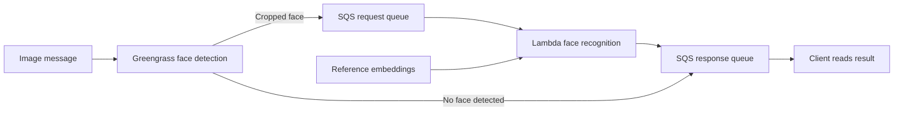

# Edge and Serverless Face Recognition

A Python face-recognition pipeline combining AWS IoT Greengrass face detection with AWS Lambda recognition and Amazon SQS messaging. Developed for CSE 546 Cloud Computing, Project 2 Part II.

## How it works

1. The Greengrass component receives image messages through local publish/subscribe.
2. MTCNN detects and crops a face, then sends a base64-encoded image to the request SQS queue.
3. A Lambda handler generates an InceptionResnetV1 embedding and selects the nearest stored reference embedding.
4. The result is sent to the response SQS queue. Images without a detected face receive a `No-Face` response from the edge component.

## Architecture

## Source layout

- `face-detection/fd_component.py` — Greengrass message handling, detection, and SQS delivery.
- `face-recognition/fr_lambda.py` — Lambda recognition handler and response delivery.

## Deployment prerequisites

This repository contains application source from the course submission. Infrastructure configuration and model assets must be supplied separately.

- Install the relevant Python dependencies: boto3, NumPy, Pillow, PyTorch, facenet-pytorch, and the AWS IoT Device SDK for the edge component.
- Provide the reference embedding/name asset expected as `resnetV1_video_weights.pt` and the pretrained model assets.
- Provision a Greengrass core, component recipe, permissions, and message routing into local publish/subscribe.
- Create request/response SQS queues and configure the Lambda SQS event source and execution role.
- Package the recognition code and model dependencies for Lambda; no Dockerfile or deployment automation is included.
- Update the topic and queue configuration to match your environment. Supply AWS access through the appropriate role or credential provider.

## Scope and validation

The source was checked for Python syntax. An end-to-end Greengrass/Lambda deployment and performance have not been revalidated for this repository. Recognition chooses the closest reference identity without an unknown-person threshold, and the edge code processes a single detected face per image.

Course-provided model assets, credentials, private keys, and assignment PDFs are not bundled.
